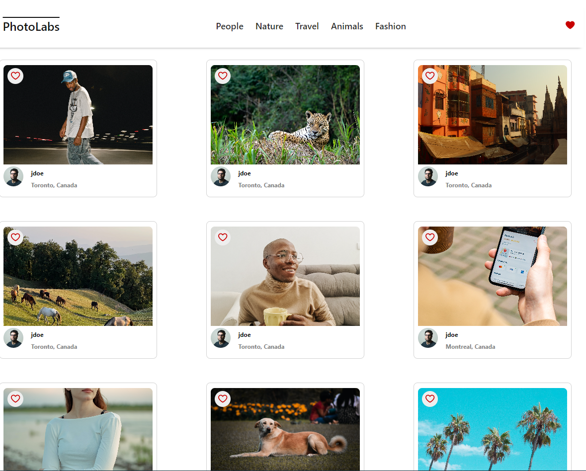
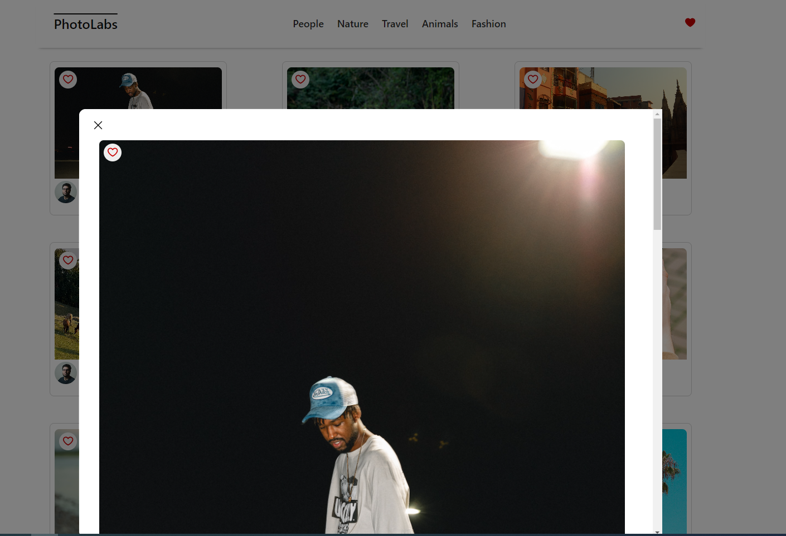
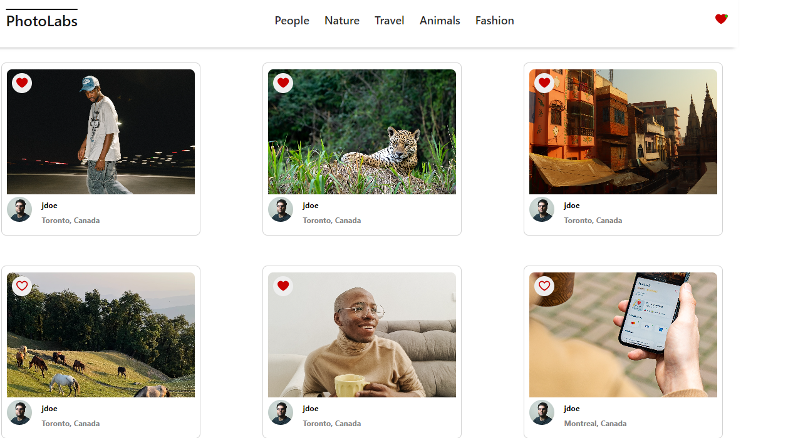

# react-photolabs
PhotoLabs is a React-based single-page application (SPA) that allows users to view photos in different contexts

# Photolabs


### Modal Page


### Liked Photos

## Setup

Install dependencies with `npm install` in each respective `/frontend` and `/backend`.

## [Frontend] Running Webpack Development Server

```sh
cd frontend
npm start
```

## [Backend] Running Backend Servier

Read `backend/readme` for further setup details.

```sh
cd backend
npm start
```
